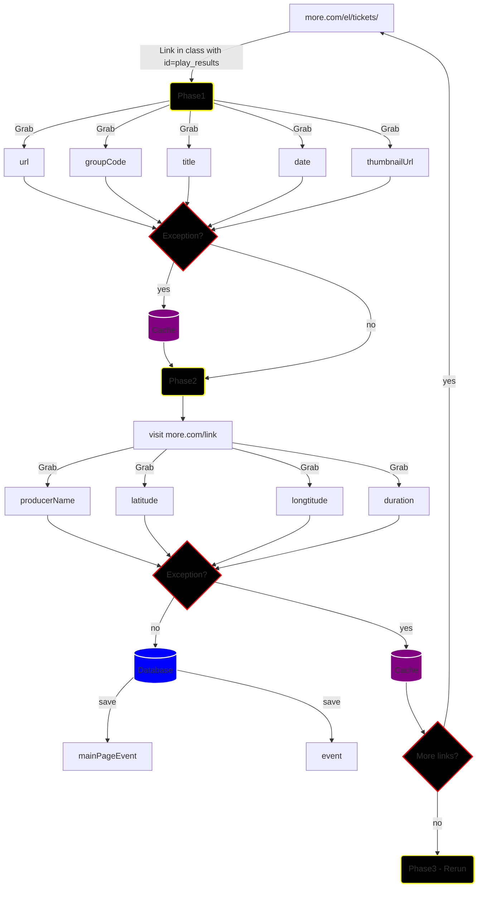

```mermaid
flowchart TD
    A[more.com/el/tickets/] -->|Link in class with id=play_results|P1(Phase1) --> |Grab|C1[url] & C2[groupCode] & C3[title] & C4[date] & C5[thumbnailUrl] --> s1
    s1{Exception?}
    s1 --> |yes|cache1[(Cache)] --> P2
    s1 ---> |no|P2(Phase2) 
    P2 --> Q[visit more.com/link] -->|Grab|D1[producerName] & D2[latitude] & D3[longtitude] & D4[duration] --> s2{Exception?}
    s2 --> |no|E[(Database)] 
    s2 --> |yes|cache2[(Cache)] 
    %% If link list is empty, there are no more links
    cache2 --> s3{More links?} ---> |no|I(Phase3 - Rerun)
    s3 --> |yes|A
    %% %% Data is split into two different tables
    E --> |save|G[mainPageEvent] & H[event]
    


    style P1 fill:#000,stroke:yellow,stroke-width:2px
    style P2 fill:#000,stroke:yellow,stroke-width:2px
    style I fill:#000,stroke:yellow,stroke-width:2px
    style s1 fill:#000,stroke:red,stroke-width:2px
    style s2 fill:#000,stroke:red,stroke-width:2px
    style s3 fill:#000,stroke:red,stroke-width:2px
    style E fill:blue,stroke:#fff,stroke-width:2px
    style cache1 fill:purple,stroke:white,stroke-width:2px
    style cache2 fill:purple,stroke:white,stroke-width:2px


```