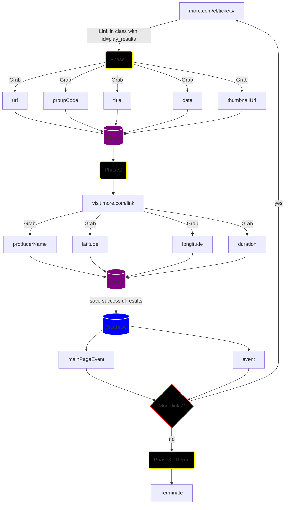

```mermaid
flowchart TD
    A[more.com/el/tickets/] -->|Link in class with id=play_results|P1(Phase1) --> |Grab|C1[url] & C2[groupCode] & C3[title] & C4[date] & C5[thumbnailUrl] --> cache1[(Cache)]
    cache1 --> P2(Phase2)
    P2 --> Q[visit more.com/link] -->|Grab|D1[producerName] & D2[latitude] & D3[longitude] & D4[duration] --> cache2[(Cache)]
    s3 --> |no|I(Phase3 - Rerun) --> Terminate
    s3 --> |yes|A
    %% Data is split into two different tables
    cache2 --> |save successful results|E[(Database)] --> G[mainPageEvent] & H[event] --> s3{More links?}


    style P1 fill:#000,stroke:yellow,stroke-width:2px
    style P2 fill:#000,stroke:yellow,stroke-width:2px
    style I fill:#000,stroke:yellow,stroke-width:2px
    style s3 fill:#000,stroke:red,stroke-width:2px
    style E fill:blue,stroke:#fff,stroke-width:2px
    style cache1 fill:purple,stroke:white,stroke-width:2px
    style cache2 fill:purple,stroke:white,stroke-width:2px


```